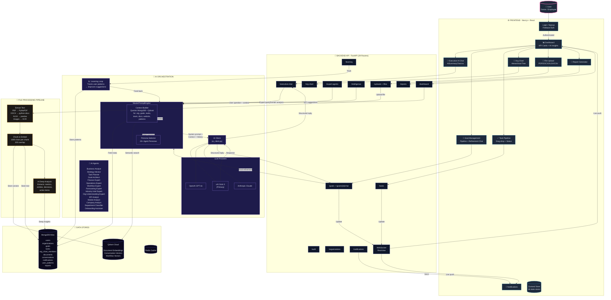

# YesBoss - Complete Flow Diagram



# How It Works (One Paragraph)

**User logs in** → sees Dashboard with KPI cards and AI insights. Can **chat with AI** (asks business questions, AI pulls context from MongoDB + Qdrant and responds via xAI Grok), **manage goals** (create, refine via AI chat with one-question-at-a-time flow), **manage tasks** (linked to goals, drag-drop pipeline), **upload files** (PDF/DOCX/etc → text extraction → embedding → Qdrant → AI can answer questions about them), **build org chart** (upload CSV → hierarchical tree), and **generate reports** (AI summary → PDF/Word download). Everything is **real-time** via WebSocket. AI has **20+ specialized personas** (Finance Expert, Goal Architect, etc.) and **learns continuously** from user patterns to personalize responses.
```
